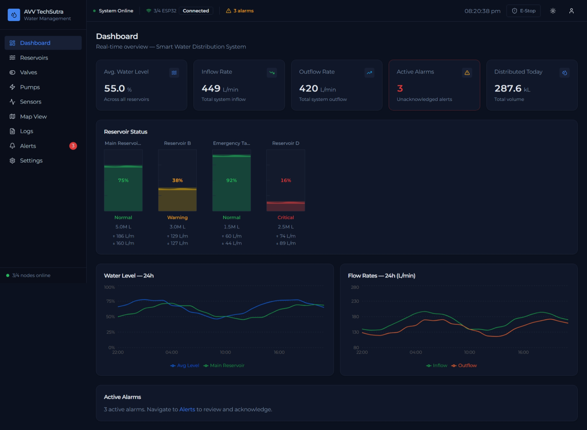
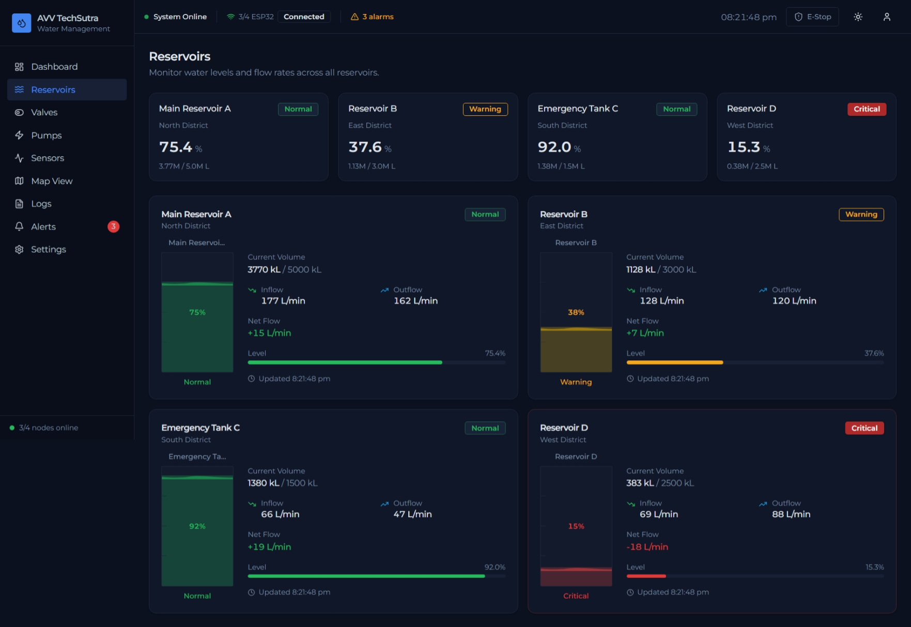
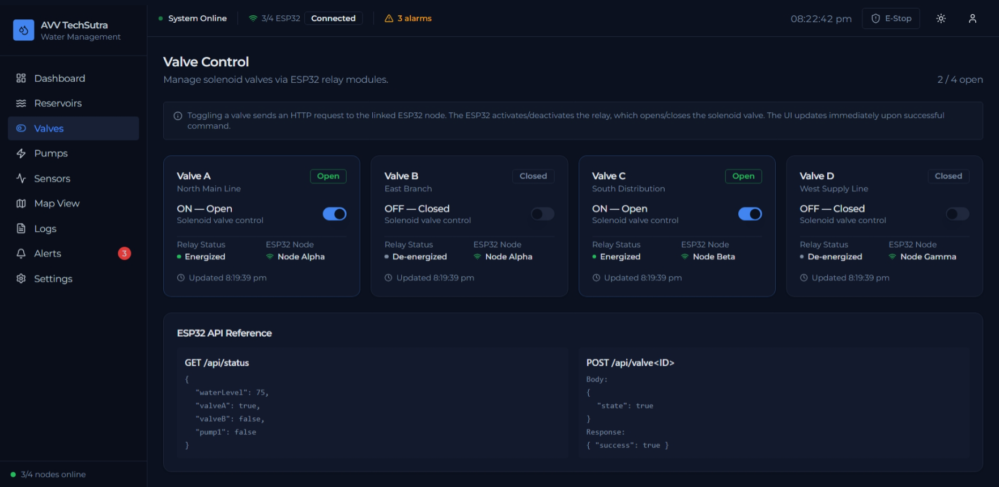
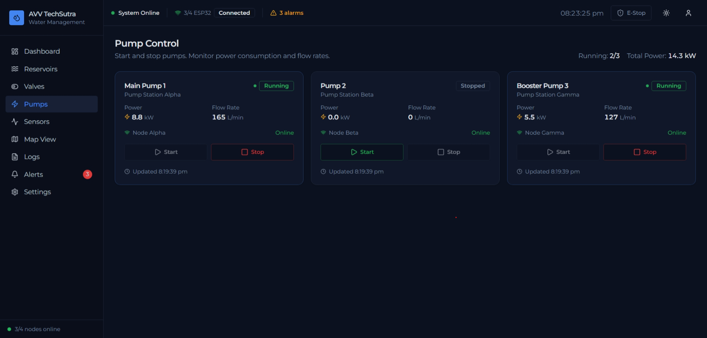
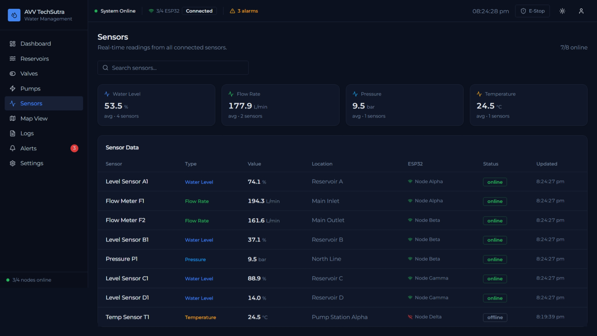
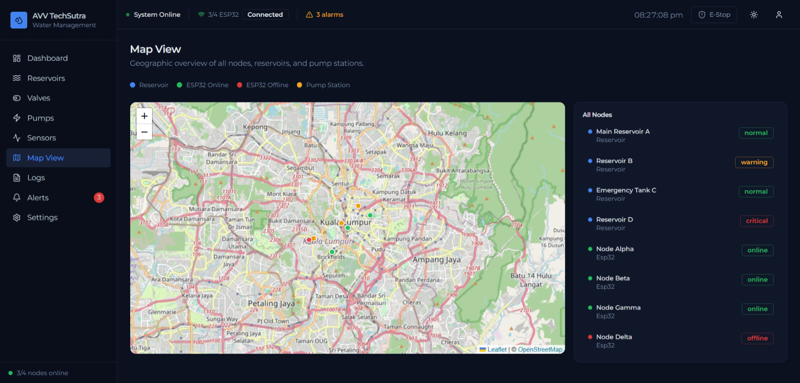
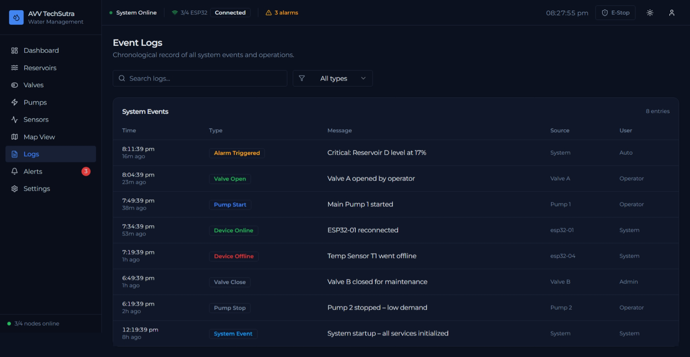
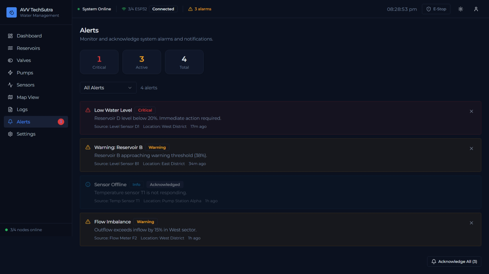
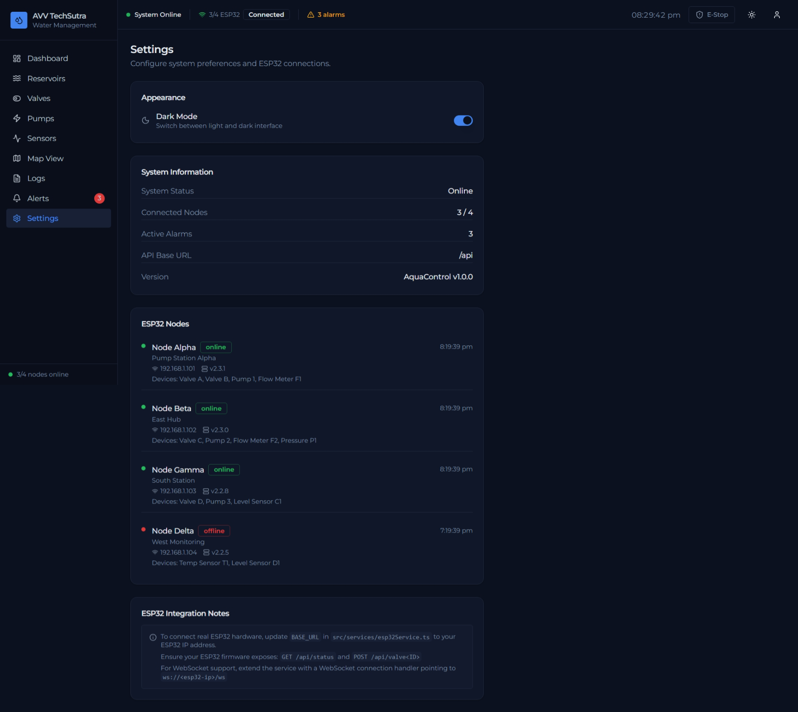

# 💧 Water Management System Dashboards

An IoT-based smart water management system designed to monitor and control water distribution efficiently using real-time automation. **Specially build for Mobile Application**.

## 📖 About the Project

**Water Management System** is an automation-focused project developed to manage water flow and valve operations through an **interactive dashboard** and IoT hardware integration.

The system uses an **ESP32 microcontroller**, relay modules, water pumps, water sensors and solenoid valves to automate water control processes while providing real-time monitoring through a web interface.

This project was built to strengthen understanding of:
- IoT and embedded systems
- Hardware-software integration
- Real-time monitoring dashboards
- Automation and control systems

## 🚀 Live Demo
🔗 Live Demo (Mock Data): https://water-management-system-puce.vercel.app/
🚧 Currently running locally

## 📸 Screenshots
**Dashboard Overview:**  

**Reservoirs Info Panel:**

**Valve Control Panel:**  

**Pumps Control Panel:**  

**Sensors Info Panel:**

**Maps view Control Panel:** 

**Logs Info Panel:**

**Alerts Control Panel:** 

**Settings Panel:** 

## ✨ Features
- Real-time monitoring
- ESP32-based automation
- Relay-controlled water valves
- Interactive dashboard UI
- Live system status updates
- Scalable architecture for multiple valves

## 🛠️ Tech Stack
- **React** – Frontend structure  
- **TailwindCSS** – Styling & layout  
- **TypeScript** – Dashboard logic  
- **Arduino IDE** – ESP32 programming
- **All other required hardwares**  - sensors, pumps, Microcontrolers, water storages, etc.

## 🧩 Using the Application

  Once the browser is open you will see the Dashboard. Navigate using
  the left sidebar to explore all 9 pages:

  - Dashboard   — KPI cards, animated reservoir tanks, 24h charts
  - Reservoirs  — Detailed water level monitoring for 4 reservoirs
  - Valves      — Toggle Valve A/B/C/D via ON/OFF switch
  - Pumps       — Start/Stop Pump 1/2/3 with power consumption data
  - Sensors     — Real-time sensor data table (level, flow, pressure)
  - Map View    — Leaflet/OpenStreetMap with node & reservoir markers
  - Logs        — Searchable event log with type filtering
  - Alerts      — Active alarms with acknowledge functionality
  - Settings    — Dark/Light mode toggle + ESP32 node status

  The top-right button in the header allows toggling Dark / Light mode.

  The "E-Stop" (Emergency Stop) button in the top bar shuts down all
  valves and pumps immediately. Click it twice to confirm, then use
  "Reset E-Stop" to restore manual control.

  All sensor data updates automatically every 3 seconds (simulated).

## 🚀 How to Run Locally

STEP 1 — Prerequisites

Make sure you have the following installed on your machine:

  • Node.js  v18 or higher  (recommended: v20 LTS or v22)
    Download: https://nodejs.org

  • pnpm  (preferred package manager used in this project)
    Install via the official installer:
      https://pnpm.io/installation
      Or

    npm install -g pnpm

  To verify installations, run:
  
    node --version     
    
  (should print v18.x.x or higher)

    
    pnpm --version     
    
  (should print 8.x.x or higher)

STEP 2 — Install Dependencies

  Run the following command inside the project folder:

    pnpm install

  This will download all required packages into the node_modules/
  folder. This may take 1–3 minutes on the first run.

  NOTE: If you prefer npm, you can also use:
  
    npm install

  NOTE: If you prefer yarn:
  
    yarn install

STEP 4 — Start the Development Server

  Run:

    pnpm dev 
  or
  
    pnpm vite

  Or with npm:

    npm run dev

  The terminal will print something like:

    VITE v6.x.x  ready in 500 ms

    ➜  Local:   http://localhost:5173/
    ➜  Network: http://192.168.x.x:5173/

  Open your browser and go to:

    http://localhost:5173

---------------------------------------------------------------------
## QUICK START SUMMARY
---------------------------------------------------------------------

  1.  cd water-management-system
  2.  pnpm install
  3.  pnpm dev (if fails use pnpm vite)
  4.  Open http://localhost:5173 in your browser

For detailed information view [HOW_TO_RUN_LOCALLY.txt](HOW_TO_RUN_LOCALLY.txt)

## 👨‍💻 Developed By                                                                                        
Abhishek Ugare                                               
Email: abhishekugare1289@gmail.com                                
LinkedIn: www.linkedin.com/in/abhishek-ugare-a289s85k                    
Portfolio: https://abhi8hero.github.io/portfolio-abhishek_ugare/
